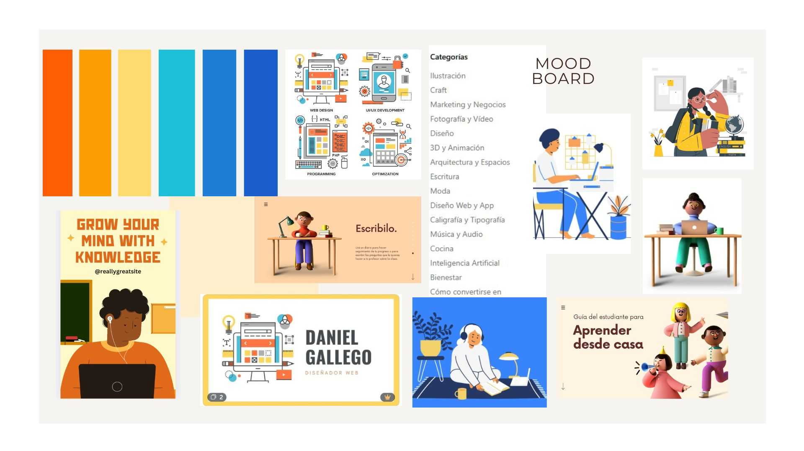

ESCRIBIR ACA NUEVO README

One page plan - plan de proyecto

PROBLEMA:PROBLEMA: ¿cual es el problema que quieren abordar?¿donde sucede el problema? TEMA: EDUCACION. Falta de difusión de cursos virtuales gratuitos en Argentina para adolescentes.

PUBLICO OBJETIVO:: ¿quienes son las personas afectadas por este problema?¿quien usaria su sitio/app? Chicos y chicas de Argentina de nivel secundario, que quieran ocupar su tiempo libre aprendiendo nuevas actividades que les puedan servir cuando tengan que salir a la vida laboral o a las universidades.

SOLUCION:Como respuesta a la problemática identificada, se propone el desarrollo de una plataforma web orientada a la recomendación, difusión y sistematización de información sobre cursos virtuales accesibles para el público general. El sitio estará diseñado con interfaces usables, intuitivas y centradas en el usuario, con el objetivo de garantizar una navegación eficiente y una experiencia digital inclusiva. Esta iniciativa se enmarca dentro del Objetivo de Desarrollo Sostenible N.º 4 (Educación de calidad), promoviendo el acceso equitativo a oportunidades de aprendizaje a lo largo de toda la vida.

FUNCIONALIDADES CLAVE: 
La página web contará con diversas funcionalidades diseñadas para mejorar la experiencia del usuario y fomentar la exploración educativa. Entre ellas se incluyen:

Test vocacional interactivo, basado en intereses y habilidades, que orientará al usuario hacia áreas de estudio o formación acordes a su perfil.

Navegación intuitiva y accesible, con enlaces claramente organizados por categorías temáticas, permitiendo un recorrido fluido y eficiente.

Funcionalidad para guardar cursos de interés, facilitando el acceso posterior a contenidos seleccionados por el usuario para su investigación o seguimiento.

Sistema de comentarios, que permitirá a los visitantes compartir sus opiniones, experiencias o consultas al final de cada publicación o curso.

